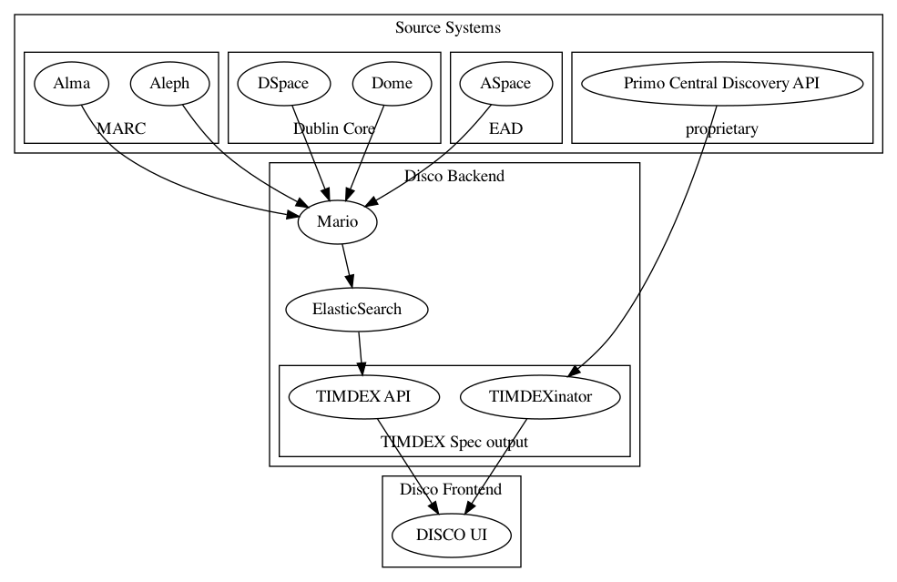

# disco-poc-vue

This is a proof-of-concept for building a library discovery UI in Vue.js.

## System overview

This repository will focus on the `DISCO UI` portion of this work.



## Project setup

```shell
yarn install
```

### Compiles and hot-reloads for development

```shell
yarn serve
```

### Compiles and minifies for production

```shell
yarn build
```

### Run your unit tests

```shell
yarn test:unit
```

### Lints and fixes files

```shell
yarn lint
```

### Customize configuration

See [Configuration Reference](https://cli.vuejs.org/config/).

Please also note that the application will need to be re-deployed using the
Heroku tooling when making adjustments to environment variables.
